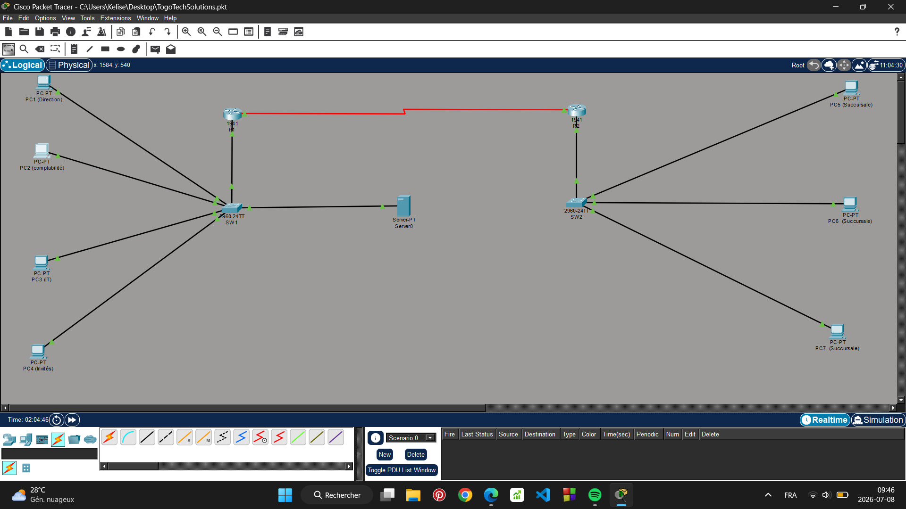
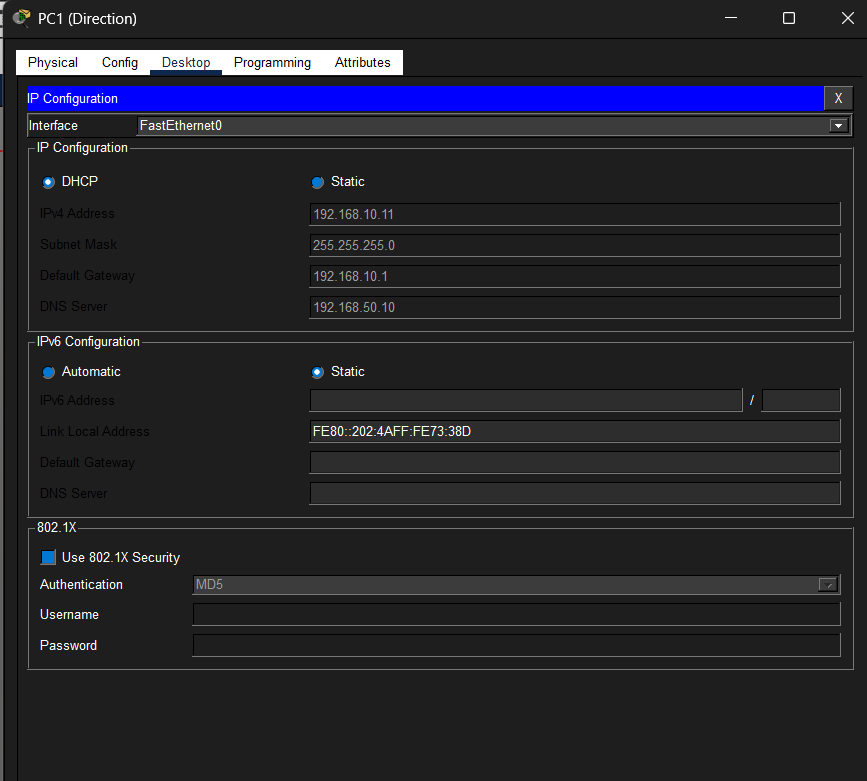
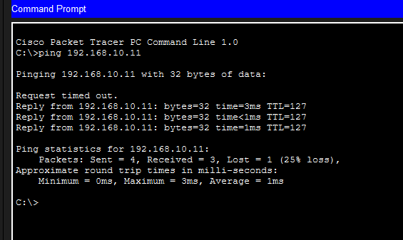
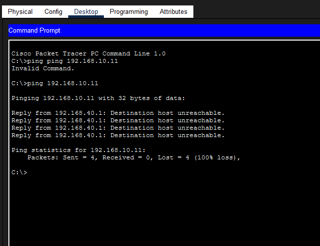
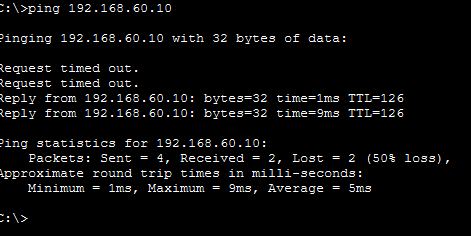
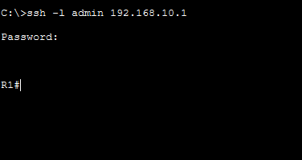
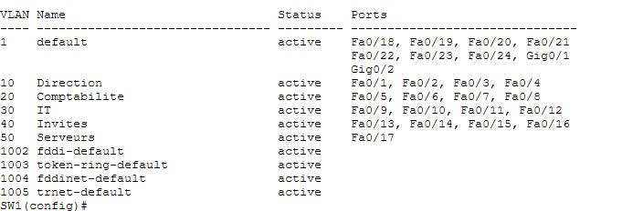
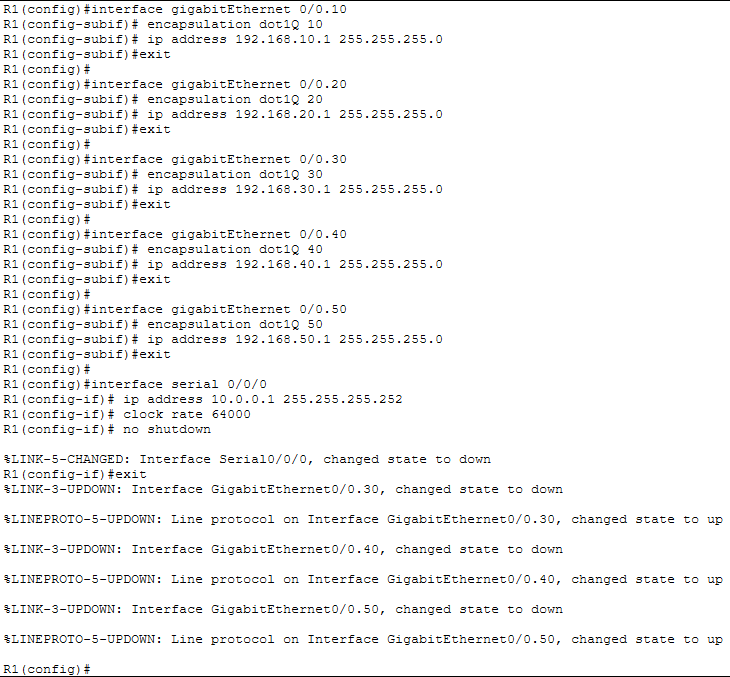
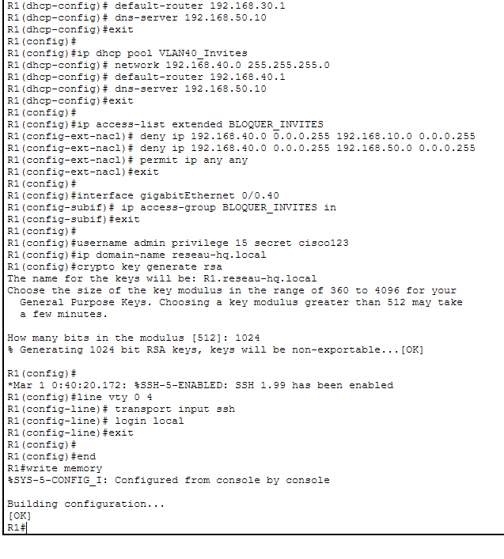
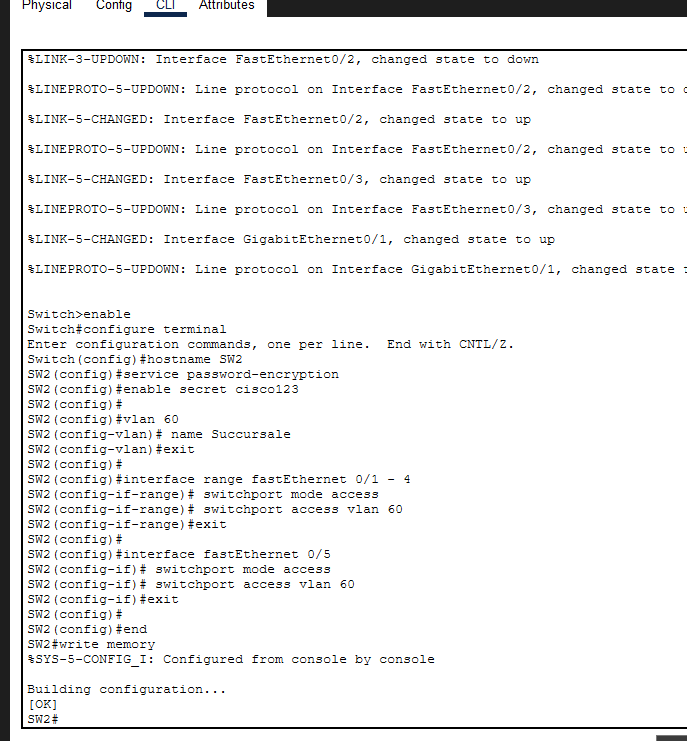

# TogoTech Solutions — Réseau d'entreprise sécurisé multi-sites

Projet de conception et de sécurisation d'un réseau d'entreprise fictif, réalisé sur Cisco Packet Tracer dans le cadre de ma pratique personnelle des fondamentaux réseau et sécurité (Cisco Networking Academy — certification *Premiers pas avec Cisco Packet Tracer*).

## Contexte

**TogoTech Solutions** est une PME fictive basée à Lomé, Togo, avec un siège social et une succursale distante. Le siège regroupe plusieurs services aux besoins d'accès différents (Direction, Comptabilité, IT, un réseau Invités pour les visiteurs, et un serveur interne), tandis que la succursale doit pouvoir accéder aux ressources du siège via une liaison WAN.

**Objectif du projet** : concevoir une architecture réseau segmentée par VLAN, interconnecter deux sites, et appliquer des mesures de sécurité de base (contrôle d'accès entre VLANs, durcissement de l'administration à distance).

## Architecture

- **Site HQ (siège, Lomé)** : 1 routeur (R1), 1 switch (SW1), 5 VLANs, 1 serveur
- **Succursale** : 1 routeur (R2), 1 switch (SW2), 1 VLAN utilisateurs
- **Liaison WAN** : interfaces série entre R1 et R2

## Plan d'adressage

| VLAN | Nom | Réseau | Passerelle | Site |
|---|---|---|---|---|
| 10 | Direction | 192.168.10.0/24 | 192.168.10.1 | Siège |
| 20 | Comptabilité | 192.168.20.0/24 | 192.168.20.1 | Siège |
| 30 | IT | 192.168.30.0/24 | 192.168.30.1 | Siège |
| 40 | Invités | 192.168.40.0/24 | 192.168.40.1 | Siège |
| 50 | Serveurs | 192.168.50.0/24 | 192.168.50.1 | Siège |
| 60 | Succursale | 192.168.60.0/24 | 192.168.60.1 | Succursale |

Liaison WAN R1 ↔ R2 : `10.0.0.0/30` (R1 = 10.0.0.1, R2 = 10.0.0.2)

## Choix techniques et de sécurité

- **Router-on-a-stick** sur R1 : une interface physique unique (Gi0/0) découpée en 5 sous-interfaces (802.1Q), pour router entre les VLANs sans multiplier les interfaces physiques.
- **DHCP par VLAN** sur R1, avec exclusion des adresses de passerelle, pour l'attribution automatique des IP aux postes du siège.
- **Port security** sur les ports d'accès de SW1 (adresses MAC sticky, maximum 2 par port, violation en mode *restrict*) pour limiter les branchements non autorisés.
- **ACL étendue (`BLOQUER_INVITES`)** appliquée sur la sous-interface du VLAN Invités : le trafic venant du VLAN 40 est bloqué vers le VLAN Direction (10) et le VLAN Serveurs (50), tout en gardant un accès général (ex. Internet) autorisé.
- **Administration à distance en SSH uniquement** sur R1 et R2 (Telnet désactivé), avec authentification par utilisateur local et mots de passe chiffrés (`service password-encryption`).
- **Routage inter-sites** : route statique de R1 vers le réseau de la succursale, et route par défaut de R2 vers R1.

## Configuration

Les scripts de configuration complets pour chaque équipement sont disponibles dans le dossier [`configuration/`](configuration/) :
- [`SW1_config.txt`](configuration/SW1_config.txt) — switch du siège (VLANs, port security, trunk)
- [`R1_config.txt`](configuration/R1_config.txt) — routeur du siège (sous-interfaces, DHCP, ACL, SSH)
- [`R2_config.txt`](configuration/R2_config.txt) — routeur de la succursale (WAN, SSH)
- [`SW2_config.txt`](configuration/SW2_config.txt) — switch de la succursale (VLAN unique)

Le fichier Packet Tracer complet est disponible ici : [`TogoTechSolutions.pkt`](TogoTechSolutions.pkt)

## Tests et validation

| # | Test | Résultat attendu | Résultat obtenu |
|---|---|---|---|
| 1 | Attribution DHCP (PC1, VLAN Direction) | IP automatique reçue | ✅ Réussi |
| 2 | Ping Comptabilité → Direction (inter-VLAN) | Réussi via routage sur R1 | ✅ Réussi (TTL décrémenté = passage par R1) |
| 3 | Ping Invités → Direction | Bloqué par l'ACL | ✅ Bloqué (`Destination host unreachable`) |
| 4 | Ping Invités → Serveur | Bloqué par l'ACL | ✅ Bloqué |
| 5 | Ping IT → Serveur | Réussi | ✅ Réussi |
| 6 | Ping Siège → Succursale (liaison WAN) | Réussi via R1 et R2 | ✅ Réussi (TTL décrémenté deux fois) |
| 7 | Connexion SSH vers R1 | Authentification et accès CLI | ✅ Réussi |

### Captures des tests

**Attribution DHCP automatique (PC1, VLAN Direction)**

**Routage inter-VLAN validé (TTL=127, un saut de routeur)**

**ACL bloquant le VLAN Invités vers le VLAN Direction**

**Liaison WAN fonctionnelle entre le siège et la succursale (TTL=126, deux sauts de routeur)**

**Connexion SSH réussie vers R1**

### Vérification de la segmentation VLAN sur SW1

### Extraits de configuration en cours de montage

## Un problème rencontré (et sa résolution)

Lors du premier test de la liaison WAN, le ping entre le siège et la succursale échouait entièrement malgré une configuration IP et de routage correcte sur R1 et R2. Diagnostic : le port `GigabitEthernet0/1` de SW2 (relié à R2) n'avait pas été explicitement rattaché au VLAN 60 — il restait par défaut dans le VLAN 1, ce qui empêchait le switch de relayer les trames du VLAN utilisateurs vers R2. Une fois le port reconfiguré en mode access sur le VLAN 60, la liaison a fonctionné immédiatement (validé par un TTL de 126, confirmant le passage par les deux routeurs).

## Compétences mises en pratique

Segmentation VLAN · routage inter-VLAN (router-on-a-stick) · configuration DHCP · listes de contrôle d'accès (ACL) · sécurisation de l'administration (SSH, port security) · routage statique inter-sites · diagnostic et résolution d'incident réseau

---

*Projet réalisé par Romuald Kpodji dans le cadre de ma pratique personnelle en cybersécurité et réseaux — [LinkedIn](#) · [GitHub](#)*
